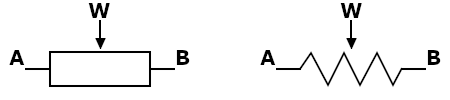

Introduction
============

**BDPotentiometer** is a python module for easy control of multichannel
digital potentiometer or rheostat.

Potentiometer
-------------
Potentiometer is a simple electrical component with three terminals.
Two terminals `A` and `B` are connected to opposite sides of the resistor,
and third terminal `W` is connected to sliding wiper contact.
Such construction makes potentiometer a variable voltage divider
made of two resistors `A-W` nd `W-B` connected in series. If a reference input voltage
is applied across `A-B` terminals, one may control the output voltage at wiper terminal
by changing its position.

Following symbols are used to depict a potentiometer.
IEC standard symbol is on the left and American ANSI symbol is on the right.

.. note::
    In BDPotentiometer wiper position is measured from terminal `B` (0, min_value)
    to terminal `A` (1, max_value).

Rheostat
--------
The use of only one terminal, for example `B`, and a wiper `W` turns potentiometer
into rheostat or variable resistor `B-W`. This is a simplest configuration of the potentiometer.

Digital Potentiometer
---------------------
The digital potentiometer is a special type of potentiometer
with electronically controlled wiper position. They usually consist of a network of resistors
connected in series. The movement of the wiper is emulated by electronic switches,
which connect certain resistor of the network to the output terminal of the digital potentiometer.
The resolution of discrete wiper movement is determined by the value
of the single resistor of the network.
